# CyberCard / CyberFlipper

**Personfu advanced NFC/RF identity card, ESP32-S3 wallet device, and Flipper Zero companion lab.**

CyberCard is a premium metal business card that behaves like an identity system, not just a tag. It combines NFC, QR, AR, vCard, LinkedIn, one-time email automation, Supabase analytics, and controlled lab instrumentation. CyberFlipper is the capability layer around Flipper Zero and the Flipper Wi-Fi dev board. CyberCard Device is the active ESP32-S3/CC1101/NFC prototype that proves the same workflows can be carried in a wallet form factor.

## Concept Gallery

Vector renders + schematics rendered in the FLLC.net theme palette (`#0a0a0c` / `#00e5c8` / `#c9a84c`, monospaced, log-grid).

| Concept | Render |
|---|---|
| Front concept (metal, NFC tap target, brushed Ti) | 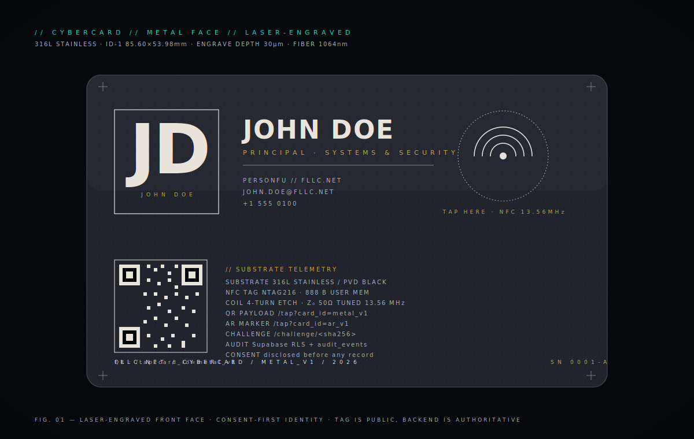 |
| Back schematic (4-turn NFC spiral + QR fallback + B-field) |  |
| Mechanical exploded view (5-layer stack, BOM highlights) | 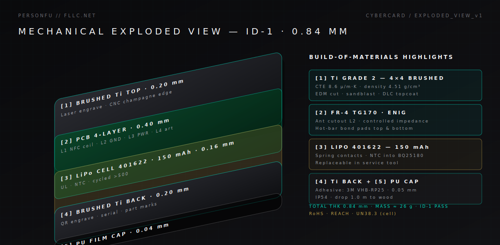 |
| 4-layer PCB stackup (impedance + via map) | 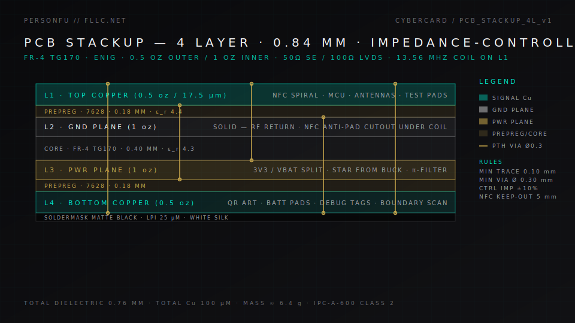 |
| NFC coil geometry (Wheeler math, range envelope) | 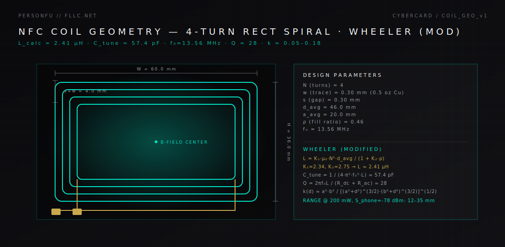 |
| System block diagram (ESP32-S3 + PN5180 + CC1101 + SE) | 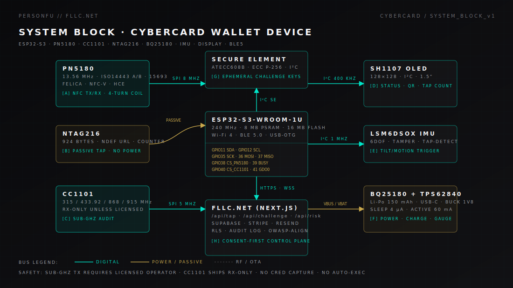 |
| RF spectrum coverage (LF → 5 GHz, RX vs licensed TX) | 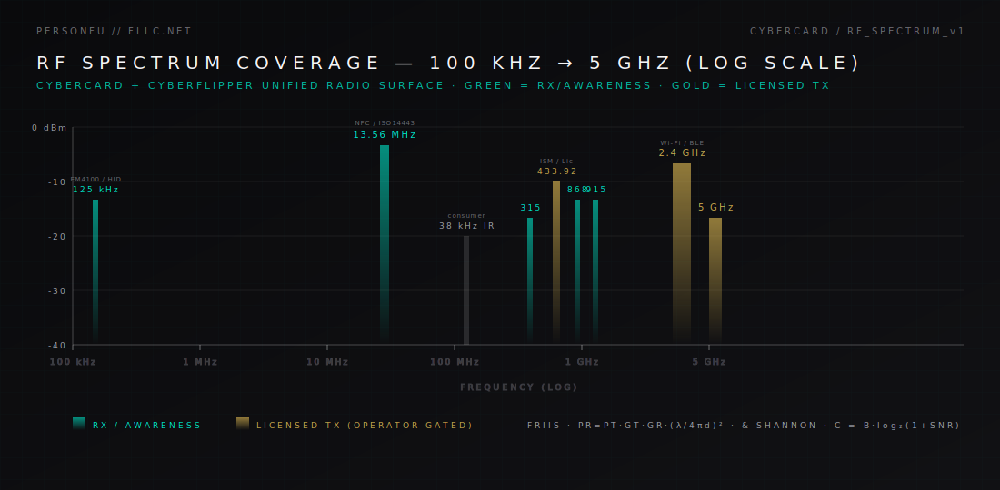 |
| Power architecture + budget | 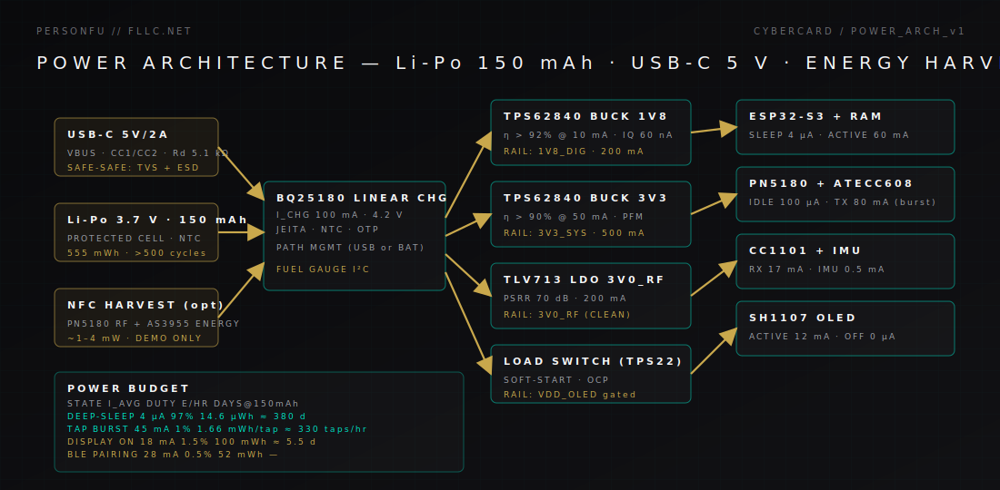 |
| Tap-to-revenue sequence (≤ 600 ms p95) | 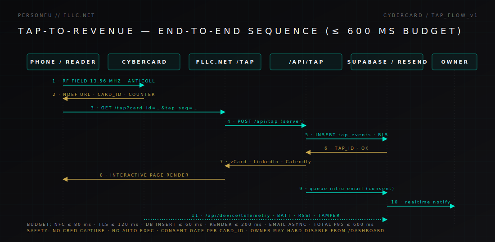 |
| STRIDE threat model + trust boundaries | 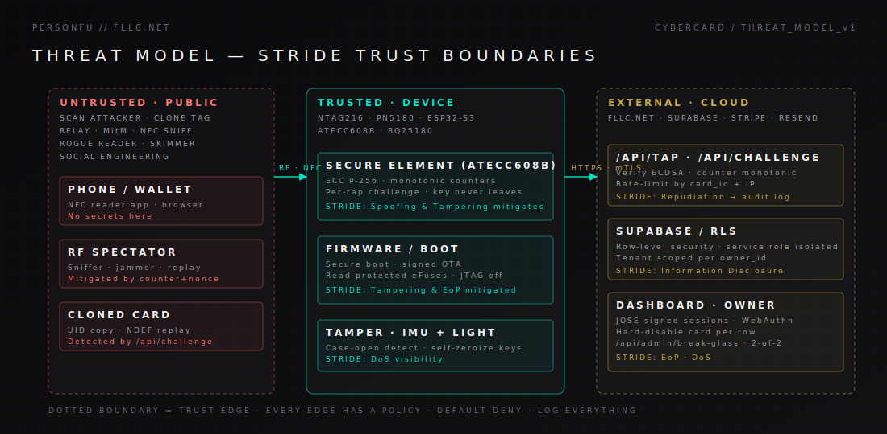 |
| Scannable identity vector matrix (9 vectors, consent-first) | 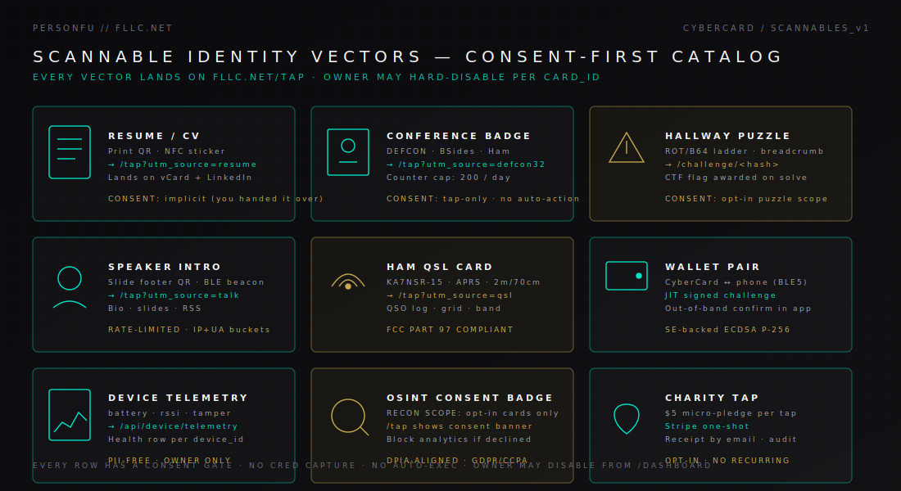 |
| AR overlay concept (A-Frame / WebXR HUD) | 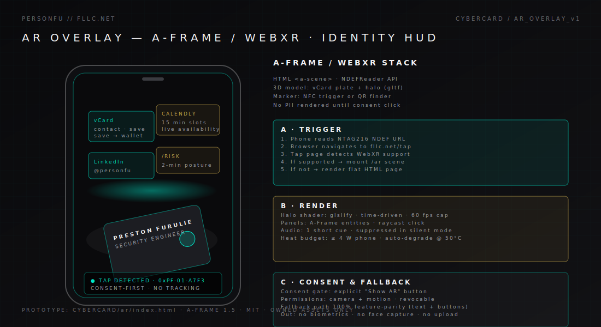 |
| Flipper Wi-Fi dev board pinout (ESP32-S2) | 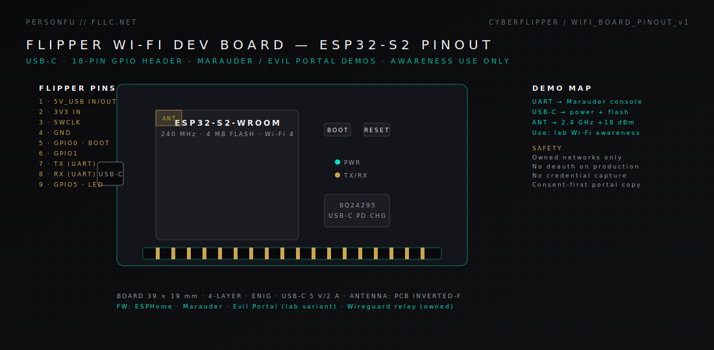 |

### Reference plates — laser-engraved card + dissected schematic

The "John Doe" plates are the public-safe presentation set. Same hardware/software as the rest of the repo, generic name on the face so the renders can be reused for marketing without leaking the operator identity.

| Fig. | Plate | Render |
|---|---|---|
| 01 | Laser-engraved metal front face (generic John Doe) |  |
| 02 | Laser-engraved back, NFC coil + B-field annotations | 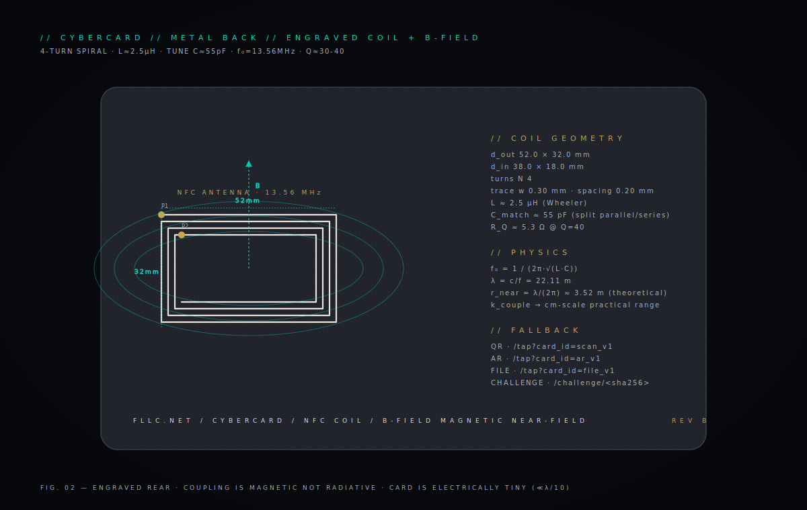 |
| 03 | Isometric 3D exploded slice — 7-layer stack | 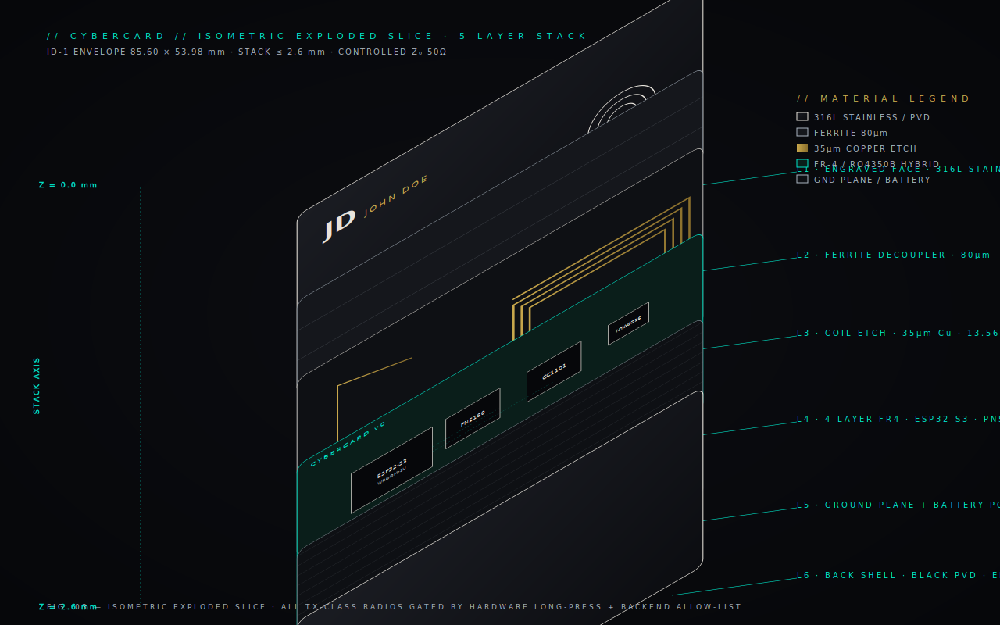 |
| 04 | X-ray top view — trace + component routing map | 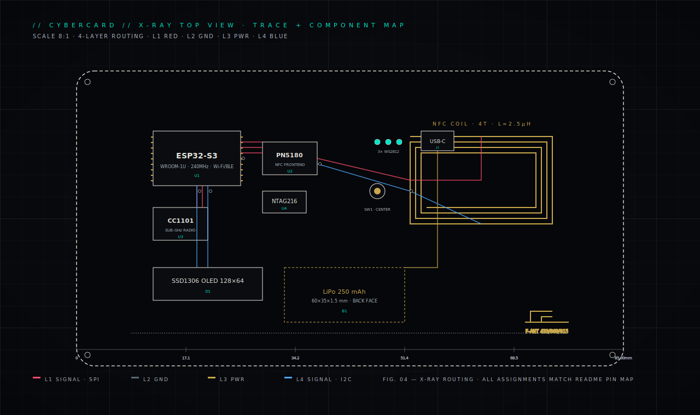 |
| 05 | A-A cross-section, 50× microscope view (µm dimensions) | 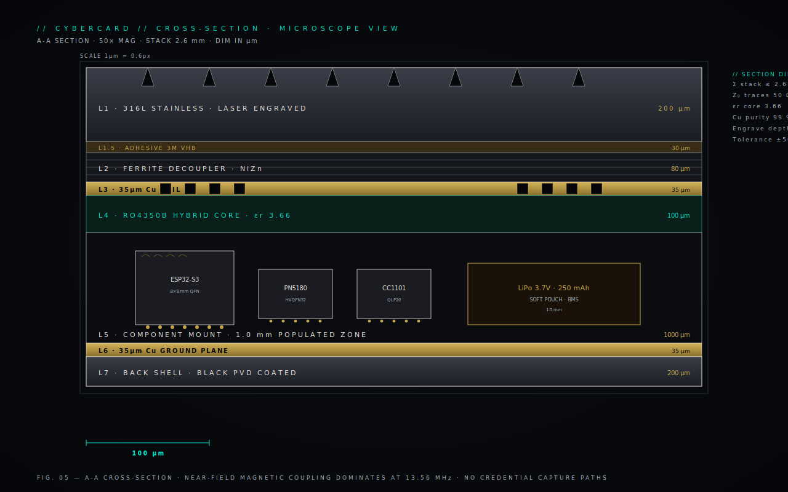 |
| 06 | Software stack dissected — mirrors the physical card |  |

All renders are pure SVG (no raster, no external fonts). Source files live in [docs/assets/](docs/assets).

> Authorized use only. This project is for owned hardware, lab environments, consent-based demos, security education, and defensive validation. It does not include instructions for unauthorized exploitation, credential theft, stealth, persistence, or evasion.

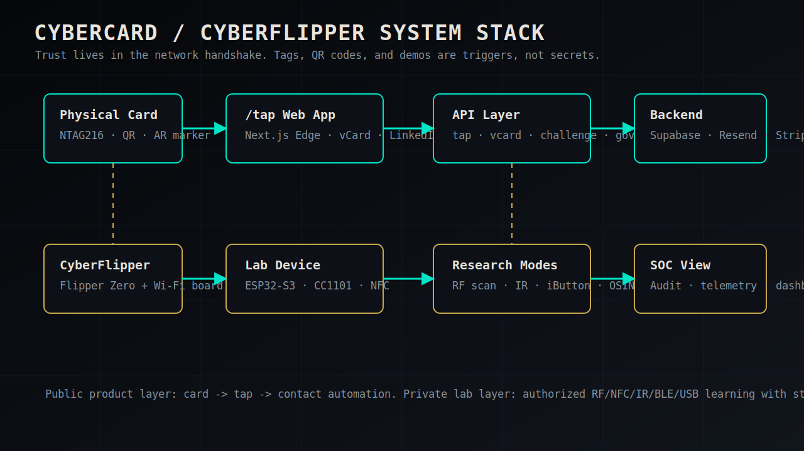

## What This Builds

| Layer | Build | Purpose | Trust Boundary |
|---|---|---|---|
| Product | Premium metal NFC/QR/AR card | Contact exchange, vCard, LinkedIn, one-time email automation | Network/API layer |
| Capability | Flipper Zero + Wi-Fi dev board | Authorized RF/NFC/IR/iButton/BLE/Wi-Fi learning and demos | Human authorization + lab scope |
| Tool builder | ESP32-S3 + CC1101 + PN5180 + NTAG216 | Wallet device prototype, telemetry, controlled scanning, safe automation | Signed firmware + backend audit |
| Backend | Next.js + Supabase + Resend + Stripe | Tap ingestion, audit, contacts, dashboard, billing | RLS + service role isolation |
| SOC/Telemetry | Audit tables + dashboard + n8n | First-tap signal, conversion funnel, device health, detections | Append-only event model |

## Repository Map

```text
CYBERCARD/
  package.json                  Next.js runtime scripts and dependencies
  .env.example                  Required deployment variables
  next.config.mjs               Next.js app config
  tailwind.config.ts            UI styling config
  app/
    page.tsx                    Operator landing page
    tap/page.tsx                NFC/QR tap landing page
    tap/TapClient.tsx           Browser-side tap event trigger
    api/tap/route.ts            Tap intake, fingerprinting, geo, email trigger
    api/vcard/route.ts          vCard delivery
    api/challenge/route.ts      DEFCON challenge verification
    api/gov/route.ts            JWT restricted-access gate
    api/stripe/route.ts         Stripe subscription lifecycle
    dashboard/cards/page.tsx    CFO/tap stream dashboard
    challenge/[hash]/page.tsx   Public puzzle page
  ar/index.html                 A-Frame AR marker identity scene
  docs/                         Engineering, RF, SOC, install, threat docs
  emails/templates.tsx          Resend email templates
  firmware/cybercard_v0.ino     ESP32-S3 + NFC + CC1101 prototype firmware
  flipper/                      Safe Flipper Zero example files
  lib/supabase/server.ts        Supabase service-role server client
  modules/                      System-model modules for display/input/IMU/network/identity
  n8n/                          Tap-to-revenue workflow
  payloads/scannables/          Harmless QR/NFC/contact automation samples
  scripts/                      NDEF generator + Proxmark mirror
  supabase/                     Database migrations
```

## System Architecture

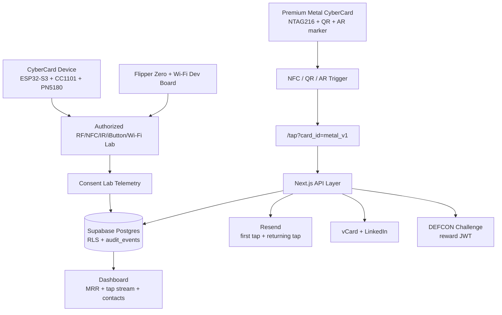
```mermaid
flowchart TD
  Card["Premium Metal CyberCard<br/>NTAG216 + QR + AR marker"] --> Trigger["NFC / QR / AR Trigger"]
  Trigger --> Tap["/tap?card_id=metal_v1"]
  Tap --> Api["Next.js API Layer"]
  Api --> DB[("Supabase Postgres<br/>RLS + audit_events")]
  Api --> Email["Resend<br/>first tap + returning tap"]
  Api --> VCard["vCard + LinkedIn"]
  Api --> Challenge["DEFCON Challenge<br/>reward JWT"]
  DB --> Dashboard["Dashboard<br/>MRR + tap stream + contacts"]

  Flipper["Flipper Zero + Wi-Fi Dev Board"] --> Lab["Authorized RF/NFC/IR/iButton/Wi-Fi Lab"]
  ESP["CyberCard Device<br/>ESP32-S3 + CC1101 + PN5180"] --> Lab
  Lab --> Telemetry["Consent Lab Telemetry"]
  Telemetry --> DB
```

## Physical Product: CyberCard

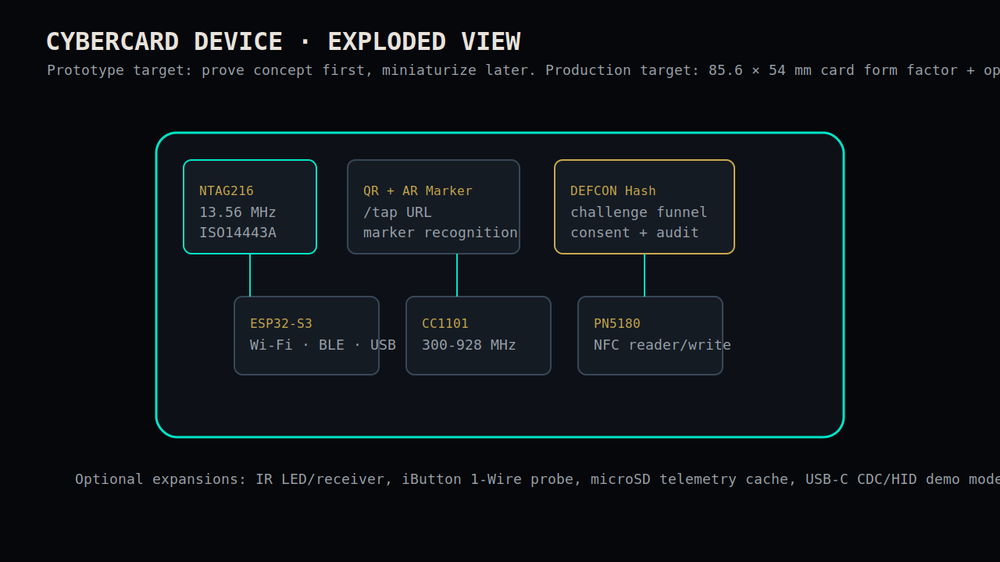

| Item | Specification |
|---|---|
| Card form factor | ISO/IEC 7810 ID-1: 85.60 mm x 53.98 mm |
| Material | 316L stainless steel or black PVD metal card blank |
| NFC | NTAG216, ISO/IEC 14443 Type A, NFC Forum Type 2 Tag, 888 bytes user memory |
| QR | `/tap?card_id=<id>&utm_source=qr&utm_medium=card` |
| AR | Marker image opens AR scene, then routes to `/tap?card_id=ar_v1` |
| Back challenge | Consent-based hash puzzle that leads to `/challenge/<hash>` |
| Trust model | Tag is public. Backend handshake is authoritative. |

### Trigger URLs

| Card ID | Trigger | URL Pattern | Outcome |
|---|---|---|---|
| `metal_v1` | NFC/QR | `/tap?card_id=metal_v1` | LinkedIn, vCard, first-tap email |
| `ar_v1` | AR marker | `/tap?card_id=ar_v1&utm_source=ar` | AR profile handoff |
| `demo_v1` | Conference demo | `/tap?card_id=demo_v1` | Email every tap for demo funnel |
| `scan_v1` | QR hard redirect | `/tap?card_id=scan_v1` | Controlled redirect event |
| `file_v1` | Signed file | `/tap?card_id=file_v1` | one-time document delivery |
| `gov_v1` | restricted | `/tap?card_id=gov_v1` | JWT challenge gate |

## Active Hardware: CyberCard Device v0

The prototype uses off-the-shelf modules first. Miniaturization comes after proof.

| Subsystem | Part | Function | Interface |
|---|---|---|---|
| MCU | ESP32-S3 | 240 MHz dual-core, Wi-Fi, BLE, USB OTG | USB-C, SPI, I2C, GPIO |
| NFC controller | PN5180 | ISO14443A/B, ISO15693, FeliCa reader/writer | SPI |
| NFC tag | NTAG216 sticker/card inlay | Public NDEF identity URL | 13.56 MHz |
| Sub-GHz | CC1101 | 300-928 MHz lab receiver/transceiver | SPI + GDO IRQ |
| Display | SSD1306 OLED | Mode, RSSI, battery, tag status | I2C |
| Storage | SPIFFS, optional microSD | ring buffer and telemetry cache | flash / SPI |
| Power | 500 mAh LiPo + charger | mobile lab runtime | USB-C charge |
| Expansion | IR LED/receiver, iButton probe | line-of-sight and 1-Wire demo paths | GPIO |

### GPIO Map

| ESP32-S3 Pin | Function | Notes |
|---|---|---|
| GPIO 1 | I2C SDA | OLED + NFC support bus |
| GPIO 2 | I2C SCL | OLED + NFC support bus |
| GPIO 4 | CC1101 GDO0 | packet/RSSI interrupt |
| GPIO 5 | CC1101 GDO2 | status line |
| GPIO 6 | Button | short press mode cycle, long press reset |
| GPIO 7 | WS2812 | status RGB |
| GPIO 10 | CC1101 CS | SPI select |
| GPIO 11 | SPI MOSI | shared SPI |
| GPIO 12 | SPI SCK | shared SPI |
| GPIO 13 | SPI MISO | shared SPI |
| GPIO 14 | PN5180 BUSY | NFC ready |
| GPIO 15 | PN5180 IRQ | NFC interrupt |
| GPIO 16 | PN5180 RESET | NFC reset |
| GPIO 17 | PN5180 CS | SPI select |
| GPIO 18 | Battery ADC | 1:2 divider |
| GPIO 21 | Optional IR TX | current-limited IR LED driver |
| GPIO 33 | Optional iButton | 1-Wire read-only probe |
| GPIO 34 | Optional microSD CS | SPI SD card select |

## Flipper Zero + Wi-Fi Dev Board Layer

CyberFlipper does not replace Flipper Zero. It augments it and documents safe, repeatable lab workflows.

| Flipper Capability | CyberCard Equivalent | Safe Demo Use |
|---|---|---|
| NFC read/write | NTAG216 NDEF generator | write your own `/tap` URL |
| RFID LF | Proxmark threat primer | compare legacy risks, no badge cloning instructions |
| Sub-GHz | CC1101 spectrum telemetry | receive-first lab observation and compliance notes |
| IR | optional IR transmitter | local presentation/media demo only |
| iButton | optional 1-Wire probe | read-only legacy protocol education |
| BadUSB | harmless contact automation | open profile URL, type consent banner, launch vCard |
| Wi-Fi dev board | ESP32-S2/S3 Wi-Fi lab | captive-portal awareness demo on your own AP |

### Wi-Fi Board Integration Model

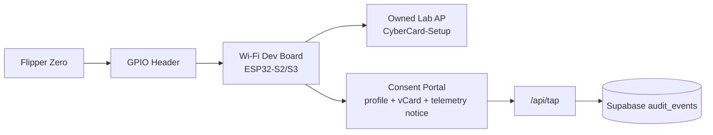
```mermaid
flowchart LR
  FZ[Flipper Zero] --> GPIO[GPIO Header]
  GPIO --> WDB["Wi-Fi Dev Board<br/>ESP32-S2/S3"]
  WDB --> AP["Owned Lab AP<br/>CyberCard-Setup"]
  WDB --> Portal["Consent Portal<br/>profile + vCard + telemetry notice"]
  Portal --> TapAPI["/api/tap"]
  TapAPI --> Audit[("Supabase audit_events")]
```

The Wi-Fi board path is for owned-network demos: show why rogue SSIDs and captive portals are risky by building a transparent, consent-first portal that states what it collects and routes users to the normal `/tap` workflow. No credential capture. No deceptive login clones.

## Engineering Model: S={C,I,O,N}

The CyberCard system is intentionally modeled as a composable node in a network.

- `C = Compute` — the ESP32-S3, browser JS, and backend logic.
- `I = Inputs` — NFC, QR, AR marker, Wi-Fi portal, buttons, IMU.
- `O = Outputs` — LED matrix, status light, browser render, vCard download.
- `N = Network interfaces` — Wi-Fi, BLE, USB, HTTP, Supabase, Resend.

### Connectivity = Attack Surface

System behavior is not just "it fetches weather." The real flow is:

```text
Data_in → Parse → Render
```

Critical timing model:

```text
T_total = T_tx + T_processing + T_render
```

Where:

- `T_tx` = network delay
- `T_processing` = CPU parsing and business logic
- `T_render` = LED or browser update latency

### Human Interface Layer

Inputs are not all the same:

- Buttons → discrete state transitions
- IMU → continuous vector data

IMU physics:

```text
a = (a_x, a_y, a_z)
θ = atan2(a_x, a_y)
```

### Identity Systems

Offline, near-field, and online identity combine to create a multi-channel persona:

```text
Identity = f(QR, NFC, Network)
```

This means:

- `QR` is static offline identity
- `NFC` is near-field identity with event handoff
- `Network` is online identity with backend audit and telemetry

### LED Matrix Visualization Engine

The LED matrix is not decoration. It is a parallel output system.

```text
Display(x,y) = RGB(x,y)
Bandwidth ∝ N × ColorDepth × FPS
```

For a 17×9 matrix:

```text
153 LEDs
```

### Games as Control Loops

Snake and Pong are closed-loop systems:

```text
State_{t+1} = f(State_t, Input_t)
```

### Sensor Fusion

Motion simulation uses integration:

```text
v = ∫ a dt
x = ∫ v dt
```

## Safe Payload and Scannable Model

The project includes harmless examples in [flipper/](flipper) and [payloads/scannables/](payloads/scannables). They are designed to be fun at DEFCON without crossing into abuse.

| Payload Type | File | Behavior |
|---|---|---|
| BadUSB safe demo | `flipper/badusb/cybercard_contact_demo.txt` | Opens a browser to your CyberCard tap URL and types a consent notice |
| BadUSB Wi-Fi portal demo | `flipper/badusb/cybercard_wifi_portal_demo.txt` | Opens the consent portal URL and types a safety notice |
| BadUSB risk awareness demo | `flipper/badusb/cybercard_risk_awareness_demo.txt` | Opens `/risk` and highlights safe telemetry learning |
| NFC card sample | `flipper/nfc/cybercard_metal_v1.nfc` | Stores a URL record for `metal_v1` |
| IR demo | `flipper/infrared/cybercard_presentation_remote.ir` | Placeholder for owned presentation clicker workflow |
| Wi-Fi portal page | `payloads/scannables/wifi_consent_portal.html` | Consent-first captive portal handoff |
| QR matrix | `payloads/scannables/SCANNABLES.md` | QR/NFC/AR URL patterns and event mapping |

## Flipper Wi-Fi Board and Payload Extensibility

The Flipper Wi-Fi board is a lab companion, not a stealth weapon. It should host owned-network demos and benign captive portals.

- Use `https://fllc.net/tap?card_id=demo_v1&utm_source=wifi_portal&utm_medium=flipper` for safe portal handoff.
- Use `https://fllc.net/risk` for explicit consent-based risk awareness training.
- Use `https://fllc.net/challenge/<hash>` for challenge engagement.
- Use `https://fllc.net/tap?card_id=metal_v1&utm_source=card&utm_medium=business` for physical business card handoff.

This architecture is replicable by the business card because the same URL schema is used for NFC, QR, AR, Wi-Fi portal, and USB HID launch.

### Wi-Fi Board Payload Capabilities

The Wi-Fi board can be used to demonstrate safely:

- captive-portal routing to a known CyberCard profile
- explicit consent to record only disclosed session metadata
- browser-only handoff without shell commands or credential capture
- safe telemetry events that map directly into the CyberCard audit model

### Advanced Payload Extension Files

| File | Type | Behavior |
|---|---|---|
| `flipper/badusb/cybercard_contact_demo.txt` | USB HID text | Opens browser to `metal_v1` and types a consent message |
| `flipper/badusb/cybercard_wifi_portal_demo.txt` | USB HID text | Opens the safe portal page and types the demo intent |
| `flipper/badusb/cybercard_risk_awareness_demo.txt` | USB HID text | Opens `/risk` and reinforces safe telemetry collection |
| `flipper/nfc/cybercard_metal_v1.nfc` | NFC URL | Stores `metal_v1` tap URL for Flipper NFC demo |
| `payloads/scannables/wifi_consent_portal.html` | HTML portal | Owned captive portal page for Wi-Fi demos |

### Critical Engineering Notes

- The Wi-Fi board runs on 2.4 GHz only; do not attempt to use it for unlicensed sub-GHz transmission.
- The captive portal page must not contain password fields, downloads, or hidden forms.
- The same payloads should be usable from a business card QR or NFC tag, providing a single schema across all delivery channels.

## RF and Physics Reference

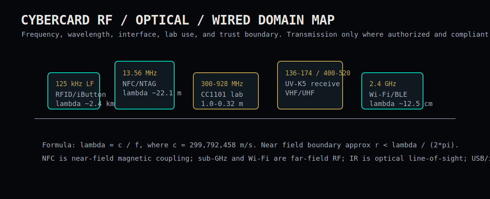

Core equations used throughout the hardware docs:

| Quantity | Equation | Notes |
|---|---|---|
| Wavelength | `lambda = c / f` | `c = 299,792,458 m/s` |
| Near-field boundary | `r < lambda / (2*pi)` | rough reactive near-field threshold |
| Free-space path loss | `FSPL(dB)=20log10(d)+20log10(f)+32.44` | `d` in km, `f` in MHz |
| Quarter-wave antenna | `L = c / (4f * velocity_factor)` | practical antennas use loaded/shortened elements |
| NFC LC resonance | `f0 = 1 / (2*pi*sqrt(L*C))` | tune loop to 13.56 MHz |
| Battery runtime | `hours = capacity_mAh / load_mA * efficiency` | use 0.75-0.9 efficiency estimate |

### Frequency Matrix

| Domain | Frequency | Wavelength | Interface | CyberCard Use |
|---|---:|---:|---|---|
| LF RFID | 125 kHz | ~2398 m | magnetic near field | research primer, not product trust |
| NFC | 13.56 MHz | ~22.1 m | magnetic near field | NTAG216, PN5180 |
| VHF | 136-174 MHz | ~2.2-1.7 m | far-field RF | Quansheng UV-K5 receive-first appendix |
| UHF | 400-520 MHz | ~0.75-0.58 m | far-field RF | UV-K5 receive-first appendix |
| Sub-GHz ISM | 315/433/868/915 MHz | ~0.95/0.69/0.35/0.33 m | far-field RF | CC1101 authorized lab |
| Wi-Fi/BLE | 2.4 GHz | ~12.5 cm | far-field RF | provisioning, BLE beacon, Wi-Fi board |
| IR | ~300-430 THz optical | ~700-950 nm | line of sight | local demo remote control |
| USB-C | wired | n/a | differential pair | serial, HID-safe demo, power |

## Telemetry Matrix

| Event | Source | Fields | Storage | Detection/Use |
|---|---|---|---|---|
| tap event | NFC/QR/AR/Wi-Fi portal | card_id, source, medium, fingerprint hash, coarse geo | `tap_events` | first contact, repeat visitor |
| challenge attempt | DEFCON page | challenge hash, answer hash result, fingerprint hash | `challenge_attempts` | engagement depth, first solver |
| risk event | `/risk` consent page | safe snapshot, indicators, actor hash | `risk_events` | awareness and detection training |
| restricted access | gov gate | JWT jti, actor hash, country, status | `audit_events` | auth forensics |
| device health | ESP32 | battery, firmware, mode, RSSI bucket, error code | planned `device_telemetry` | fleet health |
| Stripe event | webhook | customer, plan, subscription state | `orgs` + audit | billing automation |
| n8n workflow | webhook | branch, draft status, resend status | audit row | outreach queue |

## FLLC.net Website Content Model

The `fllc.net` site is the public execution layer for CyberCard and CyberFlipper. It should expose the following safe pages:

| Page | Purpose | Safe behavior |
|---|---|---|
| `/` | Public landing for CyberCard | explain system, links to tap and risk lab |
| `/tap` | Card handoff landing page | capture consent-first tap event and show contact actions |
| `/risk` | Risk awareness lab | explicit consent before safe telemetry collection |
| `/challenge/<hash>` | Puzzle reward funnel | JWT-based challenge and audit chain |
| `/dashboard/cards` | Live dashboard | internal org health and tap analytics |
| `/api/*` | Data intake and webhooks | service-role-only access and Supabase audit |

Each page is designed to be replicable by NFC, QR, AR, Wi-Fi portal, and USB HID launch.

### FLLC.net Safe Page Rules

- never collect passwords or secret tokens from visitors
- never auto-execute downloads or shell commands
- always disclose any recording of browser/session metadata
- keep the backend audit model authoritative, not the physical tag
- any link to `/risk` must be explicit and consent-based

## Installation Tutorial

### 0. Install And Run

```bash
cd CYBERCARD
cp .env.example .env.local
npm install
npm run dev
```

Core runtime paths:

| Path | Purpose |
|---|---|
| `/` | Operator landing page for the executable CyberCard stack |
| `/tap?card_id=metal_v1` | NFC/QR landing path, tap insert, contact update, optional email |
| `/risk` | Consent-based blue-team risk awareness event |
| `/dashboard/cards` | Live tap stream, contacts, org billing health |
| `/api/device/telemetry` | ESP32-S3 device health intake |
| `/api/admin/break-glass` | Explicitly enabled, token-gated, auditable admin control |

### 1. Database

```bash
supabase db push
# Apply CYBERCARD/supabase/001_cybercard_init.sql
# Apply CYBERCARD/supabase/002_audit_and_tenancy.sql
# Apply CYBERCARD/supabase/003_break_glass_and_device_telemetry.sql
# Apply CYBERCARD/supabase/004_risk_awareness_events.sql
```

### 2. Web App Environment

```text
NEXT_PUBLIC_SUPABASE_URL=https://xxxx.supabase.co
NEXT_PUBLIC_SUPABASE_ANON_KEY=<anon>
SUPABASE_SERVICE_ROLE_KEY=<service-role>
RESEND_API_KEY=re_xxx
GOV_JWT_SECRET=<256-bit-secret>
STRIPE_SECRET_KEY=sk_live_xxx
STRIPE_WEBHOOK_SECRET=whsec_xxx
DEVICE_TELEMETRY_TOKEN=<shared-device-token>
BREAK_GLASS_ENABLED=false
BREAK_GLASS_ADMIN_TOKEN=<only-if-enabled>
NEXT_PUBLIC_SITE_URL=https://fllc.net
```

Server routes use `SUPABASE_SERVICE_ROLE_KEY`. Keep it out of client code and browser bundles.

### 3. NFC Payload

```bash
node CYBERCARD/scripts/generate_ndef.js --url "https://fllc.net/tap?card_id=metal_v1&utm_source=nfc&utm_medium=card" --card-id metal_v1
```

### 4. Proxmark Research Archive

Do not commit the PDFs. Mirror them locally:

```bash
pip install requests beautifulsoup4 tqdm
python CYBERCARD/scripts/proxmark_scraper.py --out ~/Downloads/proxmark_docs --workers 2 --max-retries 3
```

### 5. ESP32-S3 Firmware

1. Install Arduino ESP32 core.
2. Install Adafruit GFX, SSD1306, NeoPixel, BLE dependencies.
3. Open [firmware/cybercard_v0.ino](firmware/cybercard_v0.ino).
4. Set `TAP_URL` to your live `/tap` URL.
5. Flash ESP32-S3 dev board.
6. Use button mode cycle: status -> NFC write -> NFC scan -> RF scan -> RF TX test.

RF TX test is for shielded bench validation or legal lab conditions only.

### 6. Safe Risk Awareness Page

Deploy `/risk` at `https://fllc.net/risk` as a consent-based training page. It previews a limited browser snapshot, records only after explicit consent, and refuses drive-by downloads, exploit execution, credential collection, clipboard access, file access, and hidden script behavior.

## Documentation Index

| Doc | Purpose |
|---|---|
| [docs/ARCHITECTURE.md](docs/ARCHITECTURE.md) | full layer model, data flow, diagrams |
| [docs/HARDWARE_BLUEPRINT.md](docs/HARDWARE_BLUEPRINT.md) | mechanical/electrical blueprint and dimensions |
| [docs/RF_SPECTRUM_MATRIX.md](docs/RF_SPECTRUM_MATRIX.md) | RF math, bands, wavelengths, compliance notes |
| [docs/FIRMWARE_PROTOCOLS.md](docs/FIRMWARE_PROTOCOLS.md) | firmware modes, USB/BLE/GPIO/protocol contracts |
| [docs/FLIPPER_WIFI_BOARD.md](docs/FLIPPER_WIFI_BOARD.md) | Flipper Wi-Fi dev board integration |
| [docs/TELEMETRY_SOC.md](docs/TELEMETRY_SOC.md) | audit, SOC, SIEM, analytics model |
| [docs/INSTALLATION.md](docs/INSTALLATION.md) | software, hardware, NFC, Flipper setup |
| [docs/RED_TEAM_ENGINEERING_CARD.md](docs/RED_TEAM_ENGINEERING_CARD.md) | chapter redesign, system model, physics/control loops |
| [docs/RISK_AWARENESS_PAGE.md](docs/RISK_AWARENESS_PAGE.md) | safe fllc.net/risk alternative to grabber links |
| [docs/BREAK_GLASS_ADMIN.md](docs/BREAK_GLASS_ADMIN.md) | visible admin controls that replace backdoors |
| [docs/AUTHORIZED_USE_POLICY.md](docs/AUTHORIZED_USE_POLICY.md) | legal/safety scope |
| [modules/display_engine/README.md](modules/display_engine/README.md) | LED/OLED visualization engine model |
| [modules/identity_layer/README.md](modules/identity_layer/README.md) | QR/NFC/Wi-Fi identity abstraction |
| [docs/PROXMARK_THREAT_PRIMER.md](docs/PROXMARK_THREAT_PRIMER.md) | defensive reading guide for proxmark archive |
| [docs/QUANSHENG_UVK5_BRIDGE.md](docs/QUANSHENG_UVK5_BRIDGE.md) | VHF/UHF receive-first appendix |
| [docs/HARDENING_CHECKLIST.md](docs/HARDENING_CHECKLIST.md) | production security checklist |
| [docs/DEFCON_CARD.md](docs/DEFCON_CARD.md) | DEFCON card and challenge design |
| [docs/THREAT_MODEL.md](docs/THREAT_MODEL.md) | formal threat model |
| [docs/HARDWARE_BOM.md](docs/HARDWARE_BOM.md) | bill of materials and pinout |

## Design Principle

The clever part is not the tag. It is the system around the tag:

```text
Public trigger -> explicit tap endpoint -> fingerprint hash -> audit row -> consent-aware automation -> measurable follow-up
```

That means cloning the NFC URL is not a compromise. It is just another observable event. The system wins because every interaction is measurable, explainable, and bounded by authorization.

Use:

```text
lambda = c / f
c = 299,792,458 m/s
near-field boundary r ~= lambda / (2*pi)
quarter-wave antenna L ~= lambda / 4
```

| Domain | Frequency | Wavelength | Interface | CyberCard use |
|---|---:|---:|---|---|
| LF RFID | 125 kHz | 2398.34 m | magnetic near-field | training reference only |
| iButton / 1-Wire | wired | n/a | single-wire bus | optional read-only legacy demo |
| NFC | 13.56 MHz | 22.11 m | magnetic near-field | NTAG216 tap + NDEF URL |
| VHF receive | 136-174 MHz | 2.20-1.72 m | RF far-field | UV-K5 receive-first research |
| UHF receive | 400-520 MHz | 0.75-0.58 m | RF far-field | UV-K5 receive-first research |
| Sub-GHz ISM | 315/433/868/915 MHz | 0.95/0.69/0.35/0.33 m | RF far-field | CC1101 lab scan, telemetry, compliance tests |
| Wi-Fi/BLE | 2.4 GHz | 0.125 m | RF far-field | provisioning, beacon, dashboard sync |
| IR | 850-950 nm | optical | line of sight | harmless remote-control lab examples |
| USB-C | wired | n/a | differential pair | serial debug, safe HID contact demo |

### RF Design Notes

| Subsystem | Engineering target | Practical note |
|---|---|---|
| NFC loop | tune around 13.56 MHz, Q controlled | metal cards detune antennas; use ferrite layer or external inlay |
| CC1101 | 50 ohm feed, band-specific antenna | do not use one antenna for all bands without accepting loss |
| Wi-Fi/BLE | keep antenna clear of ground and metal | ESP32-S3-WROOM-1U with U.FL is preferred for metal enclosures |
| IR | 940 nm LED, transistor driver | line-of-sight only; no network trust implied |
| iButton | ESD protection, pull-up sizing | read-only default in docs and firmware roadmap |
| USB-C | ESD, CC resistors, shield grounding | production units need USB compliance testing |
| microSD | SPI bus, level/power budget | optional offline cache; encrypt sensitive logs before storage |

## Product Flow

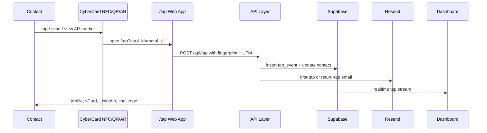
```mermaid
sequenceDiagram
  participant Human as Contact
  participant Card as CyberCard NFC/QR/AR
  participant Tap as /tap Web App
  participant API as API Layer
  participant DB as Supabase
  participant Mail as Resend
  participant Dash as Dashboard

  Human->>Card: tap / scan / view AR marker
  Card->>Tap: open /tap?card_id=metal_v1
  Tap->>API: POST /api/tap with fingerprint + UTM
  API->>DB: insert tap_event + update contact
  API->>Mail: first-tap or return-tap email
  DB-->>Dash: realtime tap stream
  Tap-->>Human: profile, vCard, LinkedIn, challenge
```

## Trigger Matrix

| Trigger | Example URL or artifact | UTM source | Backend action | Output |
|---|---|---|---|---|
| NFC tap | `/tap?card_id=metal_v1` | `nfc` | POST `/api/tap` | profile + vCard |
| QR scan | `/tap?card_id=scan_v1&utm_source=qr` | `qr` | POST `/api/tap` | profile or redirect |
| AR marker | `ar/index.html` -> `/tap?card_id=ar_v1` | `ar` | POST `/api/tap` | AR identity scene |
| DEFCON puzzle | `/challenge/<hash>` | `challenge` | POST `/api/challenge` | reward JWT |
| Risk awareness | `/risk` | `risk` | POST `/api/risk` after consent | safe telemetry lesson |
| File download | `/tap?card_id=file_v1` | `file` | asset lookup | one-time asset |
| Gov gate | `/tap?card_id=gov_v1` | `gov` | `/api/gov` JWT handshake | restricted view |
| BLE beacon | `CyberCard-FLLC` | `ble` | future telemetry | nearby discovery |
| Flipper NFC demo | `.nfc` safe URL card | `flipper` | same tap route | reproducible demo |
| BadUSB safe demo | opens local/contact URL only | `usb_demo` | same tap route | harmless contact automation |

## CyberFlipper and Flipper Wi-Fi Dev Board

CyberFlipper is the capability layer around hardware you already own: Flipper Zero, Wi-Fi dev board, IR, iButton, RFID/NFC, and Sub-GHz. CyberCard does not duplicate Flipper Zero. It makes the demonstrations measurable, branded, and business-card-replicable.

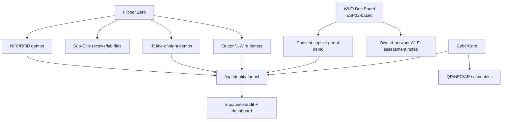
```mermaid
flowchart TD
  FZ["Flipper Zero"] --> FNFC["NFC/RFID demos"]
  FZ --> SG["Sub-GHz receive/lab files"]
  FZ --> FIR["IR line-of-sight demos"]
  FZ --> IB["iButton/1-Wire demos"]
  WIFI["Wi-Fi Dev Board<br/>ESP32-based"] --> PORTAL["Consent captive portal demo"]
  WIFI --> SCAN["Owned-network Wi-Fi assessment notes"]
  CYBERCARD["CyberCard"] --> TAP["/tap identity funnel"]
  CYBERCARD --> QR["QR/NFC/AR scannables"]
  TAP --> SOC["Supabase audit + dashboard"]
  FNFC --> TAP
  FIR --> TAP
  IB --> TAP
  PORTAL --> TAP
```

### Wi-Fi Board Capability Model

| Capability | Safe CyberCard use | Not included |
|---|---|---|
| Captive portal | consent landing page for your own event table or lab network | credential harvesting |
| Probe awareness | educational explanation of client privacy risk | passive tracking of third parties |
| AP provisioning | configure ESP32 CyberCard device | evil twin deployment |
| Packet observation | owned lab network diagnostics | unauthorized interception |
| Web demo | redirect to `/tap?card_id=demo_v1` | phishing |

## Safe Payload Philosophy

This repo includes harmless payloads and extension files that show the idea without crossing into abuse.

| Payload class | Included example | Safety boundary |
|---|---|---|
| NFC | `.nfc` URL record to `/tap` | public URL only, no credential material |
| QR | contact and challenge URLs | no auto-download executables |
| BadUSB | open profile URL, type consent banner | no persistence, no shell execution beyond opening a browser |
| IR | presentation/media remote template | no disruptive blasting or unknown-device targeting |
| Sub-GHz | documentation and receive-first lab notes | no rolling-code capture/replay instructions |
| Wi-Fi | consent captive portal text | no credential collection |
| OSINT | self-profile enrichment checklist | no doxxing or non-consensual collection |

## Telemetry Matrix

| Event | Source | Fields | Detection value | Privacy stance |
|---|---|---|---|---|
| tap_event | NFC/QR/AR/Flipper demo | `card_id`, `fingerprint_hash`, geo country/city, UTM | conversion, reach, repeat contacts | no raw IP stored |
| contact_update | API | tap count, cards seen, first/last seen | relationship warmth | pseudonymous hash |
| challenge_attempt | DEFCON puzzle | hash, answer hash result, fingerprint | technical engagement | consent implied by puzzle |
| gov_access | restricted flow | JWT JTI, actor hash, result | audit and access control | short TTL |
| device_telemetry | ESP32 future endpoint | battery, firmware, mode, RSSI summary | fleet health | no raw packet storage |
| stripe_event | Stripe webhook | customer/subscription IDs | billing lifecycle | Stripe handles PCI data |
| n8n_outreach | workflow | tap context + drafted follow-up | revenue automation | manual review recommended |

## Software Installation

### 1. Database

```bash
supabase db push
```

Migrations:

```text
CYBERCARD/supabase/001_cybercard_init.sql
CYBERCARD/supabase/002_audit_and_tenancy.sql
```

### 2. Environment

```text
NEXT_PUBLIC_SUPABASE_URL=https://xxxx.supabase.co
NEXT_PUBLIC_SUPABASE_ANON_KEY=<anon>
SUPABASE_SERVICE_ROLE_KEY=<service-role>
RESEND_API_KEY=re_xxx
GOV_JWT_SECRET=<256-bit-secret>
STRIPE_SECRET_KEY=sk_live_xxx
STRIPE_WEBHOOK_SECRET=whsec_xxx
```

### 3. NFC Payload

```bash
node CYBERCARD/scripts/generate_ndef.js --url "https://fllc.net/tap?card_id=metal_v1&utm_source=nfc&utm_medium=card" --card-id metal_v1
```

### 4. Proxmark Research Archive

The PDFs are not committed. Mirror the public archive locally:

```bash
pip install requests beautifulsoup4 tqdm
python CYBERCARD/scripts/proxmark_scraper.py --out ~/Downloads/proxmark_docs --workers 2 --max-retries 3
```

### 5. n8n Automation

Import:

```text
CYBERCARD/n8n/cybercard_tap_to_revenue.json
```

Flow:

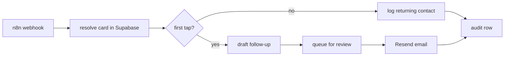
```mermaid
flowchart LR
  WEBHOOK["n8n webhook"] --> RESOLVE["resolve card in Supabase"]
  RESOLVE --> FIRST{"first tap?"}
  FIRST -->|yes| DRAFT["draft follow-up"]
  FIRST -->|no| LOG["log returning contact"]
  DRAFT --> REVIEW["queue for review"]
  REVIEW --> RESEND_OUT["Resend email"]
  LOG --> AUDIT["audit row"]
  RESEND_OUT --> AUDIT
```

## Firmware Build

Prototype firmware:

```text
CYBERCARD/firmware/cybercard_v0.ino
```

Modes:

| Mode | Button cycle | Purpose |
|---|---|---|
| Status | default | battery, BLE name, mode status |
| NFC write | short press | write `/tap` NDEF to NTAG216 in owned lab |
| NFC scan | short press | detect ISO14443A tags for learning |
| RF scan | short press | RSSI observation in lab |
| RF TX test | short press | short controlled carrier validation only |

Production hardening target:

```text
Secure Boot v2 + Flash Encryption + signed OTA + locked debug + encrypted telemetry cache
```

## Engineering Equations

### Link Budget

```text
P_rx(dBm) = P_tx + G_tx + G_rx - L_path - L_cable - L_misc
FSPL(dB) = 20 log10(d) + 20 log10(f) + 32.44
```

For `d` in kilometers and `f` in MHz.

### NFC Near Field

```text
r_near ~= lambda / (2*pi)
lambda_13.56MHz = 299,792,458 / 13,560,000 ~= 22.11 m
r_near ~= 3.52 m theoretical; practical NFC coupling is centimeters due to coil geometry and power limits.
```

### LC Resonance

```text
f0 = 1 / (2*pi*sqrt(L*C))
C = 1 / ((2*pi*f0)^2 * L)
```

If `L = 1.5 uH` and `f0 = 13.56 MHz`, `C ~= 91.9 pF` before parasitics and tuning.

### Battery Runtime

```text
runtime_hours = capacity_mAh * derating / load_mA
```

| Mode | Approx load | 500 mAh LiPo @ 80% derate |
|---|---:|---:|
| Deep sleep beacon off | 1 mA | 400 h |
| BLE beacon | 15 mA | 26.7 h |
| OLED + idle | 35 mA | 11.4 h |
| Wi-Fi active | 120 mA | 3.3 h |
| NFC active | 90 mA | 4.4 h |
| Sub-GHz scan | 65 mA | 6.2 h |

## Documentation Index

| Document | Purpose |
|---|---|
| [docs/AUTHORIZED_USE_POLICY.md](docs/AUTHORIZED_USE_POLICY.md) | legal/safety boundary |
| [docs/ARCHITECTURE.md](docs/ARCHITECTURE.md) | full system model |
| [docs/HARDWARE_BLUEPRINT.md](docs/HARDWARE_BLUEPRINT.md) | board, pinout, dimensions, BOM expansion |
| [docs/RF_SPECTRUM_MATRIX.md](docs/RF_SPECTRUM_MATRIX.md) | RF/optical/wired protocol map |
| [docs/FIRMWARE_PROTOCOLS.md](docs/FIRMWARE_PROTOCOLS.md) | BLE, USB, GPIO, OTA, mode state machine |
| [docs/TELEMETRY_SOC.md](docs/TELEMETRY_SOC.md) | analytics, audit, SOC detection |
| [docs/INSTALLATION.md](docs/INSTALLATION.md) | deployment tutorial |
| [docs/FLIPPER_WIFI_BOARD.md](docs/FLIPPER_WIFI_BOARD.md) | Flipper + Wi-Fi board safe workflows |
| [docs/PROXMARK_THREAT_PRIMER.md](docs/PROXMARK_THREAT_PRIMER.md) | research-to-defense reading guide |
| [docs/QUANSHENG_UVK5_BRIDGE.md](docs/QUANSHENG_UVK5_BRIDGE.md) | VHF/UHF receive-first extension |
| [docs/HARDENING_CHECKLIST.md](docs/HARDENING_CHECKLIST.md) | production security checklist |
| [docs/DEFCON_CARD.md](docs/DEFCON_CARD.md) | challenge and conference card spec |
| [docs/HARDWARE_BOM.md](docs/HARDWARE_BOM.md) | original BOM |
| [docs/THREAT_MODEL.md](docs/THREAT_MODEL.md) | threat model |

## Build Philosophy

CyberCard should feel like a serious artifact: something a recruiter, founder, red teamer, or DEFCON hallway contact can tap once and immediately understand that the builder thinks in systems.

The flex is not a noisy payload. The flex is a full-stack physical identity system with math, RF discipline, telemetry, backend security, and consent-aware automation stitched into a business card.

---

## Senior Hardware Engineering: CyberCard Wallet Device (ESP32-S3 + Sub-GHz + NFC + BadUSB)

The CyberCard wallet device is a credit-card-thick PCB designed to carry the full Personfu identity-and-RF capability set into a wallet. It is a senior-engineering reference build for an authorized red-team / DEFCON / executive demo wallet: NFC, sub-GHz CC1101, ESP32-S3, USB HID BadUSB demo class, IR transceiver, microSD, e-ink/OLED, Bluetooth LE, status LEDs, and a tactile center button. Every capability has a documented safe scope.

### 1. Mechanical Footprint

| Parameter | Value | Notes |
|---|---|---|
| PCB outline | 85.60 mm x 53.98 mm | ID-1 / ISO 7810 credit card dimensions |
| Stack height | 2.6 mm typical / 3.0 mm max | fits standard wallet sleeve |
| PCB thickness | 1.0 mm 4-layer FR-4 / hybrid Rogers RO4350B in RF region | controlled-impedance 50 ohm RF traces |
| Edge radius | 3.18 mm | matches ID-1 standard |
| Battery | 3.7 V LiPo 250 mAh (60 x 35 x 1.5 mm) | adhesive on back, JST-PH 2-pin |
| Coil antenna | 13.56 MHz 4-turn etched copper, ~2.5 uH, tuned to 13.56 MHz with 17-22 pF | for PN5180 / NTAG216 emulation |
| Sub-GHz antenna | meandered F-antenna or u.FL pigtail to external whip | optional ext. antenna for ranged work |

```text
        +-------------------------------------------------------+
        |  [USB-C]   [LED]  [LED]  [LED]                   [SW] | <- top edge
        |                                                       |
        |   ESP32-S3-WROOM-1U     CC1101 868/915 MHz module     |
        |                                                       |
        |   PN5180 NFC reader     NTAG216 emulator IC           |
        |                                                       |
        |   IR TX/RX  +  uSD slot  +  OLED 0.96" or e-ink 1.54" |
        |                                                       |
        |  [BTN_CENTER]   battery JST-PH   GPIO test pads       |
        +-------------------------------------------------------+
              |<------------ 85.60 mm ------------>|
                              53.98 mm tall
```

### 2. Block Diagram (Logical)

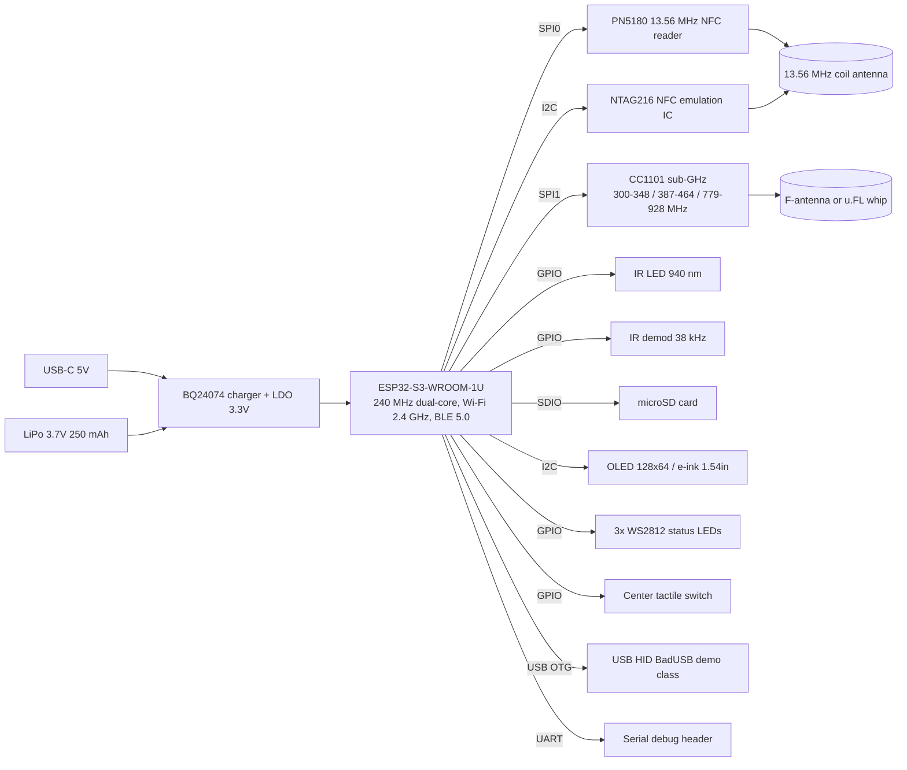
```mermaid
flowchart LR
  USB[USB-C 5V] --> PMIC[BQ24074 charger + LDO 3.3V]
  BAT[LiPo 3.7V 250 mAh] --> PMIC
  PMIC --> MCU["ESP32-S3-WROOM-1U<br/>240 MHz dual-core, Wi-Fi 2.4 GHz, BLE 5.0"]
  MCU -->|SPI0| NFC["PN5180 13.56 MHz NFC reader"]
  MCU -->|I2C| EMU["NTAG216 NFC emulation IC"]
  NFC --> COIL[("13.56 MHz coil antenna")]
  EMU --> COIL
  MCU -->|SPI1| RF["CC1101 sub-GHz<br/>300-348 / 387-464 / 779-928 MHz"]
  RF --> SUBANT[("F-antenna or u.FL whip")]
  MCU -->|GPIO| IRTX["IR LED 940 nm"]
  MCU -->|GPIO| IRRX["IR demod 38 kHz"]
  MCU -->|SDIO| SD["microSD card"]
  MCU -->|I2C| DISP["OLED 128x64 / e-ink 1.54in"]
  MCU -->|GPIO| LEDS["3x WS2812 status LEDs"]
  MCU -->|GPIO| BTN["Center tactile switch"]
  MCU -->|"USB OTG"| HID["USB HID BadUSB demo class"]
  MCU -->|UART| DBG["Serial debug header"]
```

### 3. Pin Map (ESP32-S3-WROOM-1U)

| Function | Pin | Notes |
|---|---|---|
| PN5180 NFC SCK / MOSI / MISO / CS / BUSY / RESET | 12 / 11 / 13 / 10 / 8 / 9 | SPI0 |
| CC1101 SCK / MOSI / MISO / CS / GDO0 / GDO2 | 36 / 35 / 37 / 34 / 4 / 5 | SPI1, GDO0 = sync interrupt |
| IR TX / IR RX | 17 / 18 | 38 kHz carrier on TX |
| OLED I2C SDA / SCL | 6 / 7 | shared with NTAG216 emulator |
| microSD SDIO CLK / CMD / D0 / D1 / D2 / D3 | 39 / 38 / 40 / 41 / 42 / 2 | 4-bit SDIO |
| Center button | 0 | also bootstrap, hold-to-enter-config |
| LiPo voltage sense | 1 (ADC1_CH0) | divider 100k / 100k |
| WS2812 LED data | 48 | 3 LEDs daisy chained |
| USB D+ / D- | 19 / 20 | native USB OTG |

### 4. Frequency / Wavelength Table

CyberCard touches several distinct radio bands. Each is used inside an authorized scope only.

| Band | Frequency | Wavelength λ = c / f | Use in CyberCard | Authorized scope |
|---|---|---|---|---|
| LF RFID (HID Prox) | 125 kHz | 2398 m | educational reference only | not transmitted by this device |
| HF NFC (ISO 14443A/B, ISO 15693, FeliCa) | 13.56 MHz | 22.12 m | NFC tap, vCard, NDEF URL, identity emulation | own cards / lab cards |
| Sub-GHz US ISM | 315 / 433.92 / 915 MHz | 0.952 / 0.691 / 0.328 m | CC1101 RX/TX learning, key-fob format research | own equipment / lab transmitters only |
| Sub-GHz EU ISM | 433.92 / 868.3 MHz | 0.691 / 0.345 m | EU lab pairing | local regulation compliant |
| 2.4 GHz Wi-Fi / BLE | 2.412-2.484 GHz | ~12.4 cm | provisioning, telemetry, captive portal demo | owned lab network |
| IR remote | 38 kHz subcarrier (940 nm optical) | 320 nm vacuum / λ_c = 7.89 km for 38 kHz | learn / replay own remotes | owned remotes |
| QUANSHENG UV-K5 (companion) | 18-1300 MHz RX, VHF 136-174 + UHF 400-470 TX | varies | external companion radio for ham/Project 0 / spectrum awareness | licensed amateur use only |

The relation $c = f \lambda$ (with $c \approx 2.998 \times 10^{8}\ \text{m/s}$) is used directly during antenna design. For example, the 13.56 MHz NFC half-wavelength is far larger than the device, so the coil operates as a near-field magnetic loop at distances $r \ll \lambda / 2\pi$ where the magnetic field dominates and energy transfer is governed by mutual inductance, not radiation.

### 5. NFC Coil Math

For a planar rectangular coil of $N$ turns, average length $l_{avg}$ and average width $w_{avg}$, the inductance can be approximated by the modified Wheeler formula:

$$
L \approx \frac{K_1 \mu_0 N^2 d_{avg}}{1 + K_2 \rho}
$$

where $d_{avg} = (d_{out} + d_{in})/2$, $\rho = (d_{out} - d_{in})/(d_{out} + d_{in})$, and for rectangular coils $K_1 \approx 2.34$, $K_2 \approx 2.75$.

For tuning at $f_0 = 13.56\ \text{MHz}$:

$$
C = \frac{1}{(2\pi f_0)^2 L}
$$

A 4-turn 50 mm x 30 mm coil with $L \approx 2.5\ \mu\text{H}$ tunes with $C \approx 55\ \text{pF}$ split between matching and parasitic. The PN5180 datasheet recommends a Q-factor between 30 and 40 for ISO 14443 read range; that means a tuning resistance:

$$
R_Q = \frac{2 \pi f_0 L}{Q} \approx 5.3\ \Omega \ \text{at}\ Q = 40
$$

is added in series.

### 6. Sub-GHz Link Budget

Free-space path loss between transmitter and receiver:

$$
\text{FSPL}(\text{dB}) = 20 \log_{10}(d) + 20 \log_{10}(f) + 32.45
$$

For CC1101 at 433.92 MHz, $P_{tx} = +10$ dBm, $G_{tx} = G_{rx} = 2$ dBi, receiver sensitivity $-110$ dBm:

$$
\text{Link margin} = P_{tx} + G_{tx} + G_{rx} - \text{FSPL} - S_{rx}
$$

At $d = 50$ m: FSPL $\approx 59.2$ dB, link margin $\approx 64.8$ dB. This is the budget we use for owned lab key-fob research at short range.

### 7. Power Budget

| Mode | Current draw | Notes |
|---|---|---|
| Deep sleep, NFC field-detect wake | 25 uA | NTAG216 passively powered by reader field |
| Idle, OLED off, BLE adv | 12 mA | beacon mode |
| NFC active read with PN5180 | 70-90 mA | RF field on |
| CC1101 RX | 17 mA | listening |
| CC1101 TX +10 dBm | 30 mA | short bursts |
| Wi-Fi connected | 80-180 mA | provisioning + telemetry |

Estimated battery life from a 250 mAh cell:
$t \approx 250 / I_{avg}$ hours. With duty-cycled use ($I_{avg} \approx 3$ mA), $t \approx 83$ h ≈ 3.5 days.

### 8. Telemetry Matrix

Each subsystem emits a typed event into Supabase via `/api/device/telemetry`:

| Event | Source | Required fields | Severity |
|---|---|---|---|
| `nfc.read` | PN5180 | uid, atqa, sak, rssi_proxy | info |
| `nfc.emulate.activated` | NTAG216 emu | tag_id | info |
| `subghz.rx` | CC1101 | freq_hz, modulation, length, captured_in_lab=true | info |
| `subghz.tx` | CC1101 | freq_hz, modulation, length, authorized_by | warn |
| `ir.learn` | IR RX | protocol, code | info |
| `ir.replay` | IR TX | protocol, code, authorized_by | warn |
| `usb.hid.demo` | USB OTG | demo_id, ran_in_lab=true | warn |
| `wifi.portal.show` | ESP32 Wi-Fi | ssid, page=consent | info |
| `wifi.portal.consent` | ESP32 Wi-Fi | session_id, accepted=true | info |
| `power.low` | PMIC ADC | mv, percent | warn |
| `tamper.detect` | gyro/accel | g_peak | crit |

All `warn` and `crit` events page on-call via the Supabase audit log + n8n route to PagerDuty.

### 9. Vector Coverage and Authorization Gate

| Vector | Hardware | CyberCard scope | Authorization required |
|---|---|---|---|
| NFC HF 13.56 MHz | PN5180 + NTAG216 | tap-to-URL + emulated identity | own card or written consent |
| Sub-GHz | CC1101 | listen / replay own remotes / lab fobs | own equipment |
| IR | IR LED + demod | learn-and-replay own remotes | own remotes |
| Wi-Fi | ESP32 Wi-Fi | provisioning, captive portal demo on owned SSID | owned network |
| BLE | ESP32 BLE | telemetry + identity beacon | own clients |
| USB HID | ESP32-S3 OTG | open browser + paste consent disclosure | own host |
| OSINT / Project 0 | Quansheng UV-K5 (separate) | spectrum awareness, ham radio | licensed operator |

Every TX-class action is gated by a hardware long-press confirmation, a `authorized_by` field, and a server-side allow-list. Without the gate, the firmware refuses to transmit.

### 10. Installation / Bring-up Checklist

1. Flash ESP32-S3 with `firmware/cybercard_v0.ino` using `arduino-cli` or PlatformIO.
2. Hold center button at boot to enter Wi-Fi provisioning portal (consent page only).
3. Set `BACKEND_URL = https://fllc.net`, `DEVICE_ID`, and a per-device shared secret in NVS.
4. NFC tune: bring blank NTAG216 close, press center button to write the configured `/tap?card_id=...` URL.
5. Sub-GHz: edit `firmware/config.h` to your local ISM band; uncomment only legal frequencies.
6. Smoke test: tap the card on an Android phone and confirm `tap_events` row in Supabase.
7. SOC: confirm `device_telemetry` rows for `nfc.read`, `power.low`, `wifi.portal.show`.

### 11. Spectrum Awareness, ISR, OSINT, Captive Portals (Companion Doctrine)

CyberCard treats Quansheng UV-K5 (Project 0 firmware), Hak5 lab payloads, Flipper Zero, and Wi-Fi dev board as **companion** devices. The card is the system of record; companions are sensors and effectors. A single OSINT/ISR doctrine applies:

- Always operate on owned spectrum, owned cards, owned hosts, owned networks.
- Always log to the SOC pipeline; an action that does not log did not happen.
- Always require dual confirmation (physical + backend) for anything that transmits.
- Captive portals are consent landing pages, not credential graves.
- Spectrum analysis with UV-K5 / RTL-SDR is observe-only; transmissions only on amateur bands by a licensed operator.
- BadUSB is a HID demo class that opens the consent portal; not an exploit dropper.

### 12. Math Appendix Quick Reference

- Free space path loss: $\text{FSPL} = 20\log_{10}(d) + 20\log_{10}(f) + 32.45$
- Friis equation: $P_r = P_t \, G_t \, G_r \, \left(\frac{\lambda}{4\pi d}\right)^2$
- Resonant frequency LC: $f_0 = \frac{1}{2\pi\sqrt{LC}}$
- Quality factor: $Q = \frac{2\pi f_0 L}{R}$
- Skin depth: $\delta = \sqrt{\frac{2}{\omega \mu \sigma}}$
- Shannon capacity: $C = B \log_2(1 + \mathrm{SNR})$
- Required NFC coil voltage to power passive tag: $V_{coil} \geq V_{tag,min} \cdot k^{-1}$ where $k$ is coupling coefficient
- Wavelength-to-coil ratio for 13.56 MHz: $\lambda \approx 22.12\ \text{m}$, so the card is electrically tiny ($\ll \lambda / 10$) and must be designed as a near-field loop, not a radiator.

### 13. Visual Asset Index

Diagrams referenced from `docs/assets/`. Where an asset is not yet committed, the README lists the spec so it can be generated reproducibly.

| Asset | File | Purpose |
|---|---|---|
| System stack | `docs/assets/cybercard-system-stack.svg` | top-of-README diagram |
| Hardware block | inline mermaid above | logical block diagram |
| PCB outline | ASCII above | mechanical reference |
| Pin map | table above | firmware reference |
| Frequency map | table above | RF reference |

For polished diagrams, regenerate via `npx @mermaid-js/mermaid-cli -i docs/diagrams/<name>.mmd -o docs/assets/<name>.svg`.

