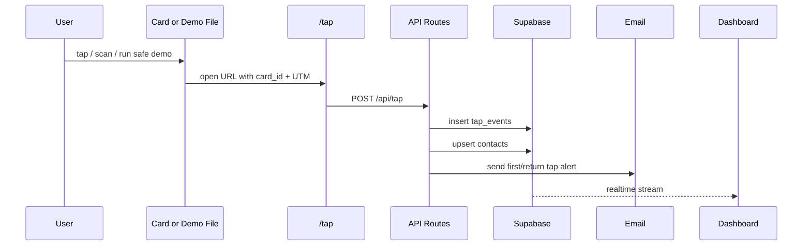

# Architecture

## Layer Model

```mermaid
flowchart TD
  P[Physical Card] --> T[NFC / QR / AR Trigger]
  T --> W[/tap Web App]
  W --> A[API Layer]
  A --> S[(Supabase)]
  A --> R[Resend]
  A --> ST[Stripe]
  S --> D[Dashboard + Analytics]

  F[CyberFlipper] --> L[Authorized Lab Workflows]
  E[ESP32-S3 CyberCard Device] --> L
  L --> SOC[SOC / Telemetry / Lessons Learned]
```

## Trust Boundaries

| Boundary | Trusted? | Rationale |
|---|---|---|
| NTAG216 URL | No | Public by design; cloneable and observable |
| QR code | No | Public trigger |
| AR marker | No | Visual trigger only |
| Browser fingerprint | Partially | Pseudonymous signal, not identity proof |
| Supabase service role | Yes | Server-side only |
| Gov gate JWT | Yes | Short TTL, signed, fingerprint-bound |
| Stripe webhook | Yes after signature | Webhook signature validated |
| Flipper examples | No | Demo artifacts; backend still validates |

## Event Pipeline



## Deployment Components

| Component | Runtime | Notes |
|---|---|---|
| `/tap` | Next.js | public card landing |
| `/api/tap` | Next.js Edge | server-side Supabase writes |
| `/api/vcard` | Next.js Edge | contact delivery |
| `/api/challenge` | Next.js Edge | puzzle verification |
| `/api/gov` | Next.js Edge | restricted JWT handshake |
| Supabase | Postgres | RLS, views, contacts, audit |
| Resend | Email API | first-tap and return-tap notifications |
| n8n | workflow | optional outreach queue |
