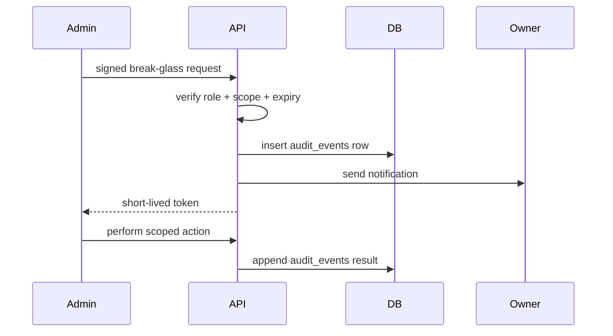

# Break-Glass Admin Controls

This is the safe substitute for any concept of a backdoor.

## Model

## Rules

- visible
- logged
- scoped
- revocable
- time-limited
- owner-notified

## Example Use Cases

| Use case | Scope |
|---|---|
| revoke lost card | update one `cards.active` flag |
| rotate challenge | update one challenge row |
| export audit | time-bounded CSV export |
| pause email automation | disable one workflow |

No remote shell, no exploit runner, no silent persistence.
