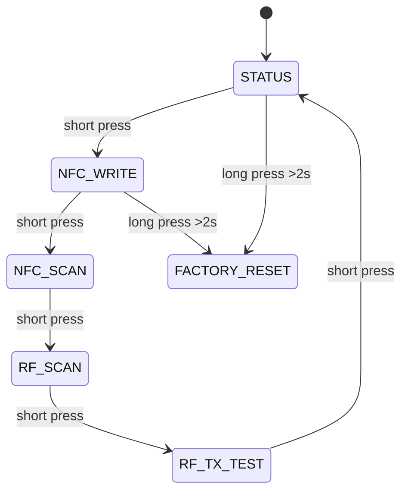

# Firmware Protocols

## Mode State Machine



## Safe Firmware Principles

- default to receive/read-only modes
- make RF TX short, visible, and lab-scoped
- cache telemetry locally only when needed
- sign production OTA images
- lock debug interfaces for production builds
- expose admin actions through audited APIs, not hidden paths

## BLE GATT Draft

| Service | UUID | Characteristic | Direction | Purpose |
|---|---|---|---|---|
| CyberCard Device | `7f2e0001-7d9b-4a3e-9a4d-cybercard001` | battery | read | battery percent |
| CyberCard Device | same | mode | read/write | switch safe modes |
| CyberCard Device | same | tap_url_hash | read | confirm provisioned URL hash |
| CyberCard Device | same | telemetry_summary | read | local health summary |

## USB-C Modes

| Mode | Class | Safe behavior |
|---|---|---|
| debug | CDC serial | logs, firmware status, config |
| contact demo | HID keyboard | open profile URL, type disclosure banner |
| storage future | MSC | read-only docs bundle, no executables |

## Packet-to-LED Visualization

```text
intensity = clamp((RSSI_dBm + 100) / 60, 0, 1)
column = floor(time_bucket % matrix_width)
color = gradient(low=blue, mid=cyan, high=gold)
```

## Real-Time Budget

```text
T_total = T_sensor + T_process + T_render
T_render < 16 ms for 60 FPS
```

| Task | Target |
|---|---:|
| button debounce | 25-50 ms stability |
| BLE advertisement update | <= 1 s |
| OLED status refresh | 4-10 FPS |
| LED matrix activity view | 30-60 FPS |
| tap URL provisioning | < 2 s perceived |
