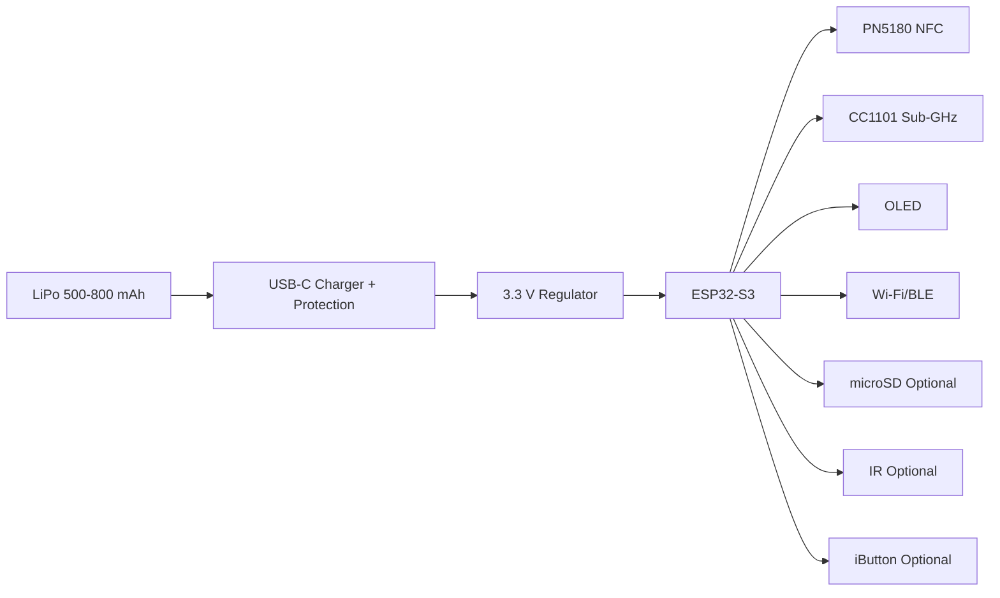

# Hardware Blueprint

## Mechanical Targets

| Assembly | Dimension | Notes |
|---|---:|---|
| Passive card | 85.60 x 53.98 x 0.8 mm | ISO card geometry |
| Active module | 55 x 35 x 8 mm target | wallet/pocket companion |
| NFC inlay | 35-45 mm loop equivalent | ferrite layer recommended behind metal |
| QR code | 25 x 25 mm | ECC H for engraving tolerance |
| AR marker | 15-25 mm | high contrast, matte finish |
| USB-C opening | 9.0 x 3.5 mm keepout | enclosure-dependent |

## Electrical Blocks

## Expanded BOM Deltas

| Optional Feature | Suggested Part | Approx BOM Delta | Reason |
|---|---|---:|---|
| IR TX/RX | 940 nm IR LED + TSOP receiver | $0.50 | safe line-of-sight demos |
| iButton | ESD diode + pogo/reader cup | $1.20 | read-only 1-Wire education |
| microSD | push-push microSD socket | $0.80 | offline telemetry cache |
| Fuel gauge | MAX17048 or equivalent | $1.10 | accurate battery reporting |
| U.FL antenna | ESP32-S3-WROOM-1U | $0.70 | metal enclosure friendly |

## PCB Notes

- Four-layer board: signal, ground, power, signal.
- Keep RF traces short, 50 ohm controlled impedance where practical.
- Separate NFC loop from sub-GHz and 2.4 GHz antenna zones.
- Add ESD protection at USB-C, iButton, external antenna, and user-touch points.
- Route battery sense through a high-value divider and disable when sleeping if possible.

## Production Risks

| Risk | Mitigation |
|---|---|
| Metal card detunes NFC | ferrite sheet, external inlay, measure with VNA |
| CC1101 harmonics | proper matching/filtering, pre-compliance scan |
| USB-C ESD | TVS diode array and shield strategy |
| LiPo safety | protected cell, thermal margin, charge rate validation |
| debug port exposure | lock JTAG, secure boot, flash encryption |
