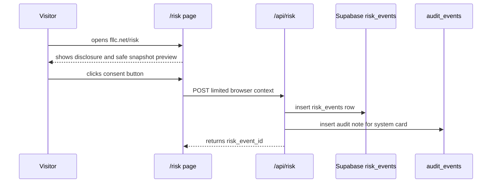

# /risk Awareness Page

`/risk` is the blue-team-safe version of a vulnerability or grabber link.

It demonstrates what a dangerous page might try to do while refusing to do it. Nothing executes on the visitor's machine, no exploit is downloaded, and no credentials/files/clipboard/cookies are collected.

## Flow

## Collected After Consent

| Field | Reason |
|---|---|
| timezone | demonstrates fingerprint surface |
| language | demonstrates localization surface |
| screen size | demonstrates browser surface |
| color depth | demonstrates browser surface |
| touch points | demonstrates device class |
| platform | coarse platform signal |
| do-not-track | privacy preference |
| referrer presence | link context, not full referrer |
| URL path | confirms `/risk` scenario |
| coarse country | Vercel header, if present |
| hashed actor | pseudonymous correlation |

## Explicitly Not Collected

- raw IP address
- cookies
- local storage
- session storage
- credentials
- clipboard
- files
- browser history
- installed software
- OS commands
- shell execution
- exploit downloads

## Detection Lessons

| Unsafe pattern | Blue-team detection idea |
|---|---|
| drive-by download | alert on unexpected executable content type |
| hidden form fields | inspect DOM and CSP reports |
| shell command strings | scan submitted payloads and logs for suspicious patterns |
| obfuscated script | monitor CSP violations and script hashes |
| credential collection | flag forms imitating third-party brands |
| suspicious redirects | log redirect chains and destination category |

## Why This Is Better

A real grabber teaches the wrong lesson and creates real risk. `/risk` teaches the useful model: attack surface, consent boundary, data minimization, detection telemetry, and auditability.
